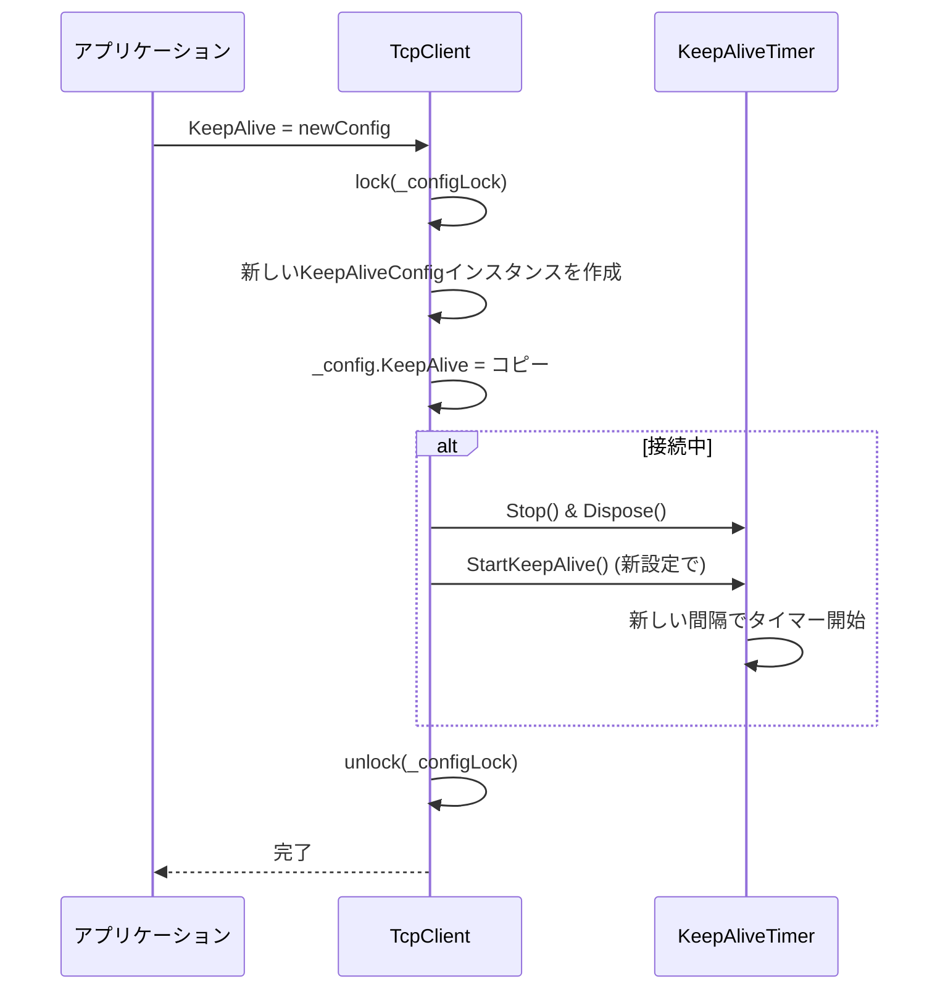

# 動的設定変更機能の追加

## 概要

現在、`appsettings.json`から読み込んだ設定は静的なため、実行時に変更できません。クライアント設定（KeepAlive、タイムアウト、リトライポリシーなど）をアプリ実行中に動的に変更できるようにします。

## 実装内容

### 1. インターフェースの拡張

[Core/ITcpClient.cs](Core/ITcpClient.cs)に設定プロパティを追加：

- `KeepAliveConfig? KeepAlive { get; set; }` - KeepAlive設定の取得・設定
- `int TimeoutMilliseconds { get; set; }` - タイムアウト設定の取得・設定
- `RetryPolicy? RetryPolicy { get; set; }` - リトライポリシーの取得・設定
- `RetryPolicy? ConnectionRetryPolicy { get; set; }` - 接続リトライポリシーの取得・設定

### 2. TcpClientの実装

[Core/TcpClient.cs](Core/TcpClient.cs)に以下を実装：

- **`_config`フィールドの変更**：
  - `readonly`を削除して変更可能にする
  - 設定変更用のロックオブジェクト`_configLock`を追加

- **プロパティの実装**：
  - **KeepAliveプロパティ**：
    - getter: 現在の設定のコピーを返す（nullの場合はnullを返す）
    - setter: 新しい設定のコピーを保存し、接続中の場合にタイマーを再起動
    - 既存の`_keepAliveTimer`を停止・破棄してから新しい設定で`StartKeepAlive()`を呼び出し

  - **TimeoutMillisecondsプロパティ**：
    - getter: `_config.TimeoutMilliseconds`を返す
    - setter: バリデーション（正の値）後に`_config.TimeoutMilliseconds`を更新

  - **RetryPolicyプロパティ**：
    - getter: 現在の設定のコピーを返す（nullの場合はnullを返す）
    - setter: 新しい設定のコピーを保存

  - **ConnectionRetryPolicyプロパティ**：
    - getter: 現在の設定のコピーを返す（nullの場合はnullを返す）
    - setter: 新しい設定のコピーを保存

- **スレッドセーフティ**：
  - すべてのプロパティアクセスを`_configLock`で保護
  - KeepAliveタイマーの操作もロック内で実行

- **オブジェクト参照の保護**：
  - `KeepAliveConfig`と`RetryPolicy`はオブジェクト参照のため、getter/setterで新しいインスタンスを作成してコピーを返す
  - これにより、外部からの直接変更を防ぐ

### 3. サンプルアプリケーションの拡張

[Samples/TcpMessenger.Sample/Program.cs](Samples/TcpMessenger.Sample/Program.cs)に設定変更の例を追加：

- クライアントモードと統合モードで、対話的に設定を変更できるメニューを追加
- 例：
  - `config`コマンドで設定変更メニューを表示
  - `config show`で現在の設定を表示（プロパティのgetterを使用）
  - `config keepalive`でKeepAlive設定の変更（プロパティのsetterを使用）
    - 有効/無効、間隔、メッセージの変更
  - `config timeout`でタイムアウト設定の変更
  - `config retry`でリトライポリシーの変更

## 実装の詳細

### KeepAlive設定変更の処理フロー



### プロパティの実装例

```csharp
// ITcpClient.cs
KeepAliveConfig? KeepAlive { get; set; }
int TimeoutMilliseconds { get; set; }
RetryPolicy? RetryPolicy { get; set; }
RetryPolicy? ConnectionRetryPolicy { get; set; }

// TcpClient.cs
private ClientConfig _config; // readonlyを削除
private readonly object _configLock = new();

public KeepAliveConfig? KeepAlive
{
    get
    {
        lock (_configLock)
        {
            return _config.KeepAlive == null ? null : 
                new KeepAliveConfig
                {
                    Enabled = _config.KeepAlive.Enabled,
                    IntervalSeconds = _config.KeepAlive.IntervalSeconds,
                    Message = _config.KeepAlive.Message
                };
        }
    }
    set
    {
        lock (_configLock)
        {
            _config.KeepAlive = value == null ? null : 
                new KeepAliveConfig
                {
                    Enabled = value.Enabled,
                    IntervalSeconds = value.IntervalSeconds,
                    Message = value.Message
                };
            
            if (IsConnected)
            {
                _keepAliveTimer?.Stop();
                _keepAliveTimer?.Dispose();
                _keepAliveTimer = null;
                
                if (_config.KeepAlive?.Enabled == true)
                {
                    StartKeepAlive();
                }
            }
        }
    }
}
```

## 注意事項

- **KeepAlive設定の変更**：既存のタイマーを適切に停止・破棄してから新しい設定で再起動する
- **接続中の制限**：接続中でも設定変更可能だが、一部の設定（例：リモートホスト/ポート、エンコーディング）は接続中に変更できない（これらはプロパティとして公開しない）
- **スレッドセーフティ**：すべてのプロパティアクセスをロックで保護し、競合状態を防止
- **オブジェクト参照の保護**：`KeepAliveConfig`と`RetryPolicy`はgetter/setterで新しいインスタンスを作成してコピーを返すことで、外部からの直接変更を防ぐ
- **バリデーション**：`TimeoutMilliseconds`などはsetterで正の値であることを確認する
- **既存コードへの影響**：`_config`が`readonly`から通常のフィールドに変更されるが、既存の読み取り処理には影響しない